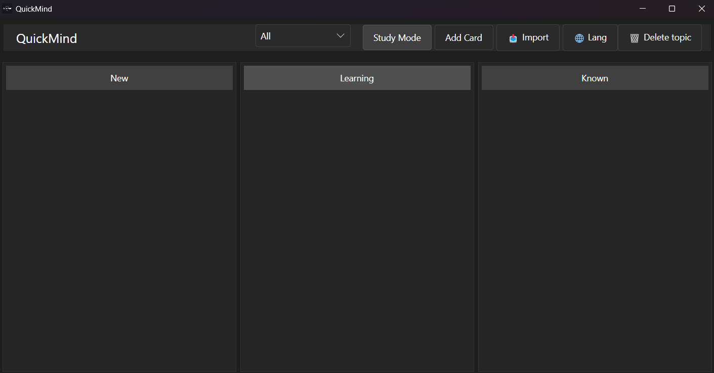

# QuickMind 🧠

<div align="center">
  
  
  **Advanced flashcard application with spaced repetition algorithm for efficient learning**
  
  [](https://dotnet.microsoft.com/)
  [](https://avaloniaui.net/)
  [](LICENSE.txt)
</div>

## 📸 Application Screenshot

<div align="center">
  
  <p><em>QuickMind main interface with kanban board for card management</em></p>
</div>

## 📥 Download

Ready to start learning? Download QuickMind for your platform:

<div align="center">
  
  [](https://github.com/ddenvy/QuickMind/releases/latest)
  [](https://github.com/ddenvy/QuickMind/releases/latest)
  [](https://github.com/ddenvy/QuickMind/releases/latest)
  
  **Windows**: `QuickMind-Setup-v2.2.0.exe` (34.2 MB)  
  **macOS**: DMG files for Intel & Apple Silicon (45 MB)
  **Linux**: Multiple package formats available (35-50 MB)
  
  *Latest version: v2.2.0*
  
</div>

### Installation Instructions

- **Windows**: Download and run the `.exe` installer from [Releases](https://github.com/ddenvy/QuickMind/releases)
- **macOS**: Download the appropriate `.dmg` file for your Mac (Intel or Apple Silicon)
- **Linux**: Choose from multiple package formats:
  - **DEB** (Ubuntu/Debian): `quickmind_VERSION_amd64.deb`
  - **RPM** (Fedora/RHEL/openSUSE): `quickmind-VERSION-1.*.x86_64.rpm`
  - **AppImage** (Universal): `QuickMind-VERSION-x86_64.AppImage`
  - **Flatpak**: `QuickMind-VERSION.flatpak`
  - **Snap**: `quickmind_VERSION_amd64.snap`
  - **Source packages** for Arch Linux and Gentoo

📖 **Detailed Linux installation guide**: [docs/LINUX-INSTALL.md](docs/LINUX-INSTALL.md)

---

## ✨ Features

### 🎯 Advanced Spaced Repetition Algorithm
- **SM-2+ Algorithm** - Enhanced version of the classic SuperMemo algorithm
- **Multi-step Learning** - New cards progress through multiple learning steps
- **Relearning Process** - Forgotten cards automatically return to learning cycle
- **Leech Detection** - Automatic identification and suspension of problematic cards
- **Interval Fuzzing** - Random interval adjustment to prevent card clustering
- **Flexible Settings** - Customize algorithm parameters to match your learning style

### 📊 Smart Rating System
- **4-point Scale**: Again / Hard / Good / Easy
- **Color-coded Buttons** - Intuitive colors for each rating level
- **Adaptive Intervals** - Review intervals automatically adjust based on your ratings

### 📈 Comprehensive Statistics
- **Daily Statistics** - Cards due today, studied, and forgotten
- **Topic Progress** - Track success in each subject area
- **Learning History** - Detailed statistics for all study sessions
- **Difficulty Analysis** - Identify your most challenging cards

### 📥 Import from Anki and Other Sources
- **Anki JSON** - Import exported decks from Anki
- **CSV Files** - Import from Excel/Google Sheets
- **Text Files** - Import with customizable separators
- **APKG Support** - Planned for future versions

### 🎨 Modern Interface
- **Kanban Board** - Visual card management by status
- **Dark Theme** - Minimalist design for comfortable learning
- **Responsive Layout** - Optimized for different screen sizes
- **Smooth Animations** - Fluid transitions between states

### 🌍 Multi-language Support
- **3 Interface Languages**: English, Russian, Chinese
- **Localized Tooltips** - All UI elements fully translated
- **Instant Switching** - Interface adapts immediately to selected language

### 🏷️ Topic Management
- **Organization by Topics** - Group cards by subjects
- **Topic Deletion** - Remove entire topics with their cards
- **Topic Statistics** - Separate statistics for each topic

## 🚀 Getting Started

### System Requirements

- [.NET 9.0 SDK](https://dotnet.microsoft.com/download/dotnet/9.0) or later
- Git (for cloning the repository)

### Installation from Source

1. **Clone the repository**
   ```bash
   git clone https://github.com/your-username/QuickMind.git
   cd QuickMind
   ```

2. **Restore dependencies**
   ```bash
   dotnet restore
   ```

3. **Run the application**
   ```bash
   dotnet run
   ```

### Building for Release

#### Local Build
To create a release build locally:

```bash
dotnet publish -c Release -r win-x64 --self-contained
```

Replace `win-x64` with your target platform:
- Windows: `win-x64`, `win-arm64`
- macOS: `osx-x64`, `osx-arm64`
- Linux: `linux-x64`, `linux-arm64`

#### Automated Installers

QuickMind includes scripts for automatic installer creation:

**Windows Installer (Inno Setup)**
```bash
./installer/Build-Windows-Installer.ps1 -Version "2.2.0"
```

**macOS DMG (Intel + Apple Silicon)**
```bash
./installer/Build-macOS-Installer.sh
```

**All Platforms**
```bash
./installer/Build-All.ps1 -Version "2.2.0"
```

## 📖 How to Use

### First Launch
1. Select your preferred language from the welcome screen
2. Start adding your first flashcards using the "Add Card" button

### Creating Flashcards
1. Click **"Add Card"** in the main window
2. Fill in the question and answer fields
3. Choose an existing topic or create a new one
4. Preview your card and save

### Studying
1. Click **"Study Mode"** to begin learning
2. Read the question and try to recall the answer
3. Click **"Show Answer"** to reveal the correct answer
4. Rate your knowledge:
   - **"Again"** (red) - don't remember, need to review soon
   - **"Hard"** (orange) - remember with difficulty, interval increases slightly
   - **"Good"** (green) - remember well, standard interval
   - **"Easy"** (blue) - remember easily, maximum interval

### Importing Cards
1. Click **"Import"** in the main window
2. Select file to import (JSON, CSV, TXT)
3. Specify topic name for imported cards
4. Configure import parameters if needed
5. Click "Import" to add cards

### Card Management
- **New Cards**: Recently added cards waiting to be studied
- **Learning Cards**: Cards in active learning process
- **Known Cards**: Cards you've mastered

## 🛠️ Technology Stack

- **Framework**: .NET 9.0
- **UI Framework**: Avalonia UI 11.0
- **Architecture**: MVVM (Model-View-ViewModel)
- **Database**: SQLite with Entity Framework Core
- **Styling**: Custom dark theme with Corus font
- **Dependency Injection**: Microsoft.Extensions.DependencyInjection

## 🎨 Design Philosophy

QuickMind follows a minimalist design approach inspired by modern learning platforms:

- **Dark Theme**: Reduces eye strain during long study sessions
- **Clean Typography**: Corus font for optimal readability
- **Subtle Colors**: Muted color palette for distraction-free learning
- **Intuitive Layout**: Three-column card organization for easy progress tracking

## 📁 Project Structure

```
QuickMind/
├── Assets/                 # Images and icons
├── Models/                # Data models and database context
├── Services/              # Business logic and services
│   ├── CardService.cs     # Card management
│   ├── SpacedRepetitionService.cs # Spaced repetition algorithm
│   ├── AnkiImportService.cs # Import from external sources
│   └── LocalizationService.cs # Multi-language support
├── ViewModels/            # MVVM view models
├── Views/                 # UI views and windows
├── App.axaml             # Application styles and resources
├── Program.cs            # Application entry point
└── QuickMind.csproj      # Project configuration
```

## 🌍 Supported Languages

- 🇺🇸 **English** - Full support
- 🇷🇺 **Russian** - Full support  
- 🇨🇳 **Chinese** - Full support

## 🔧 Algorithm Settings

QuickMind offers flexible spaced repetition algorithm settings:

- **Learning Steps**: Configure steps for new cards
- **Graduating Interval**: Interval for cards transitioning to review
- **Easy Interval**: Interval for cards rated as "Easy"
- **Maximum Interval**: Limit on maximum review interval
- **Leech Threshold**: Number of failures before card suspension

## 🤝 Contributing

Contributions are welcome! Here's how you can help:

1. Fork the repository
2. Create a feature branch (`git checkout -b feature/amazing-feature`)
3. Commit your changes (`git commit -m 'Add amazing feature'`)
4. Push to the branch (`git push origin feature/amazing-feature`)
5. Open a Pull Request

### Development Guidelines

- Follow MVVM pattern for UI logic
- Use meaningful commit messages
- Add comments for complex logic
- Test your changes across different platforms

## 📄 License

This project is licensed under the MIT License - see the [LICENSE.txt](LICENSE.txt) file for details.

## 🙏 Acknowledgments

- [Avalonia UI](https://avaloniaui.net/) for the excellent cross-platform UI framework
- [Entity Framework Core](https://docs.microsoft.com/en-us/ef/core/) for database management
- [SuperMemo](https://supermemo.com/) for the SM-2 algorithm
- [Anki](https://apps.ankiweb.net/) for inspiration in spaced repetition
- The open-source community for inspiration and tools

## 📞 Support

If you encounter any issues or have questions:

1. Check the [Issues](https://github.com/your-username/QuickMind/issues) page
2. Create a new issue with detailed information
3. Include your OS version and steps to reproduce

---

<div align="center">
  Made with ❤️ for learners everywhere!
  
  **Happy Learning! 🎓**
</div> 